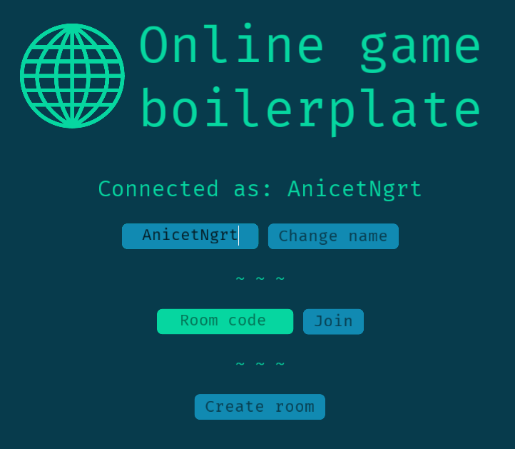
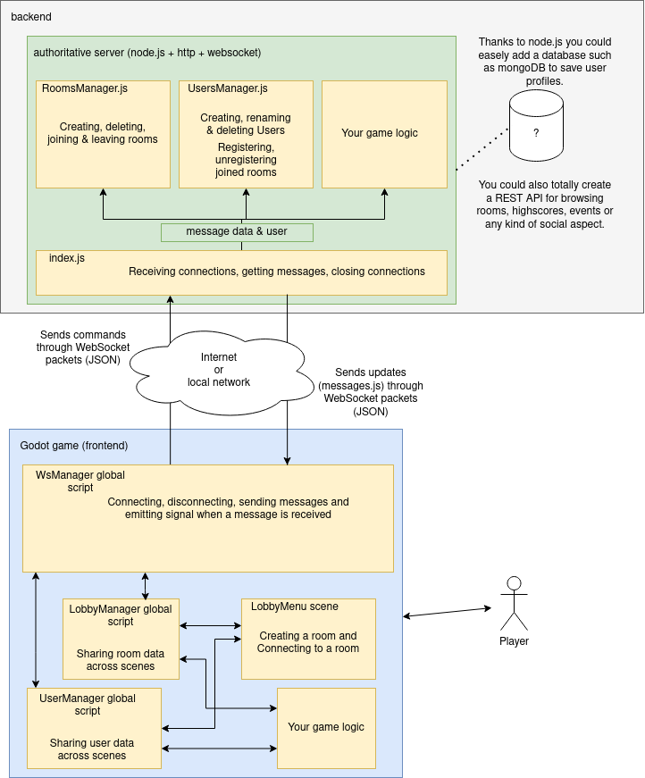

- [What is it ?](#what-is-it-)
- [How it works](#how-it-works)
- [How to launch](#how-to-launch)

# What is it ?

This is a template you can start any (casual) multiplayer project from.

It implements the very popular **game room** and **secret code connection system**. Which you
certainly have already experienced in games such as **Among Us** or **Agar.io**.

This is based on [Node.js](https://nodejs.org/en/), an insanely popular javascript runtime for backend software (webservers,
real-time game servers, APIs...). Although making game servers with Node.js is not very memory efficient,
unlike the traditionnal way of doing which involves C or C++ (or even Rust nowadays), developping with
it is very easy and fast. It is super appropriate for making [Minimal Viable Products](https://www.youtube.com/watch?v=F_1km66t8jQ). Just avoid having AAA trafic and
advanced security concerns.

For the frontend it is plain [Godot Engine](https://godotengine.org/) and GdScript. 
It connects to the server via [WebSockets](https://docs.godotengine.org/en/stable/tutorials/networking/websocket.html).

# How it works

## The system

In this room system a client (or frontent) (the player's version of the software) connects via a 
networking protocol to a server (a private and confidential software, which is part of the backend).

The client declares itself with a name the player has chosen through the game's UI,
and the server then accepts the connection and assigns an ID to the client.

Then the player is prompted with two choices: create a game (or room) or join a game (or room).

When a player chooses to create a game, the room's code is given to it by the server. The player can 
then give it to the other players for them to join with.

When a player chooses to connect, it has to enter the room's code.

When someone joins or leaves a room, all the guests are notified.

When the room has no guests anymore, it is automatically deleted.

When all guests declare themselves as ready, the game starts.

Once a game is started, no one can join it anymore.

## Architecture and stack

# How to launch

## Running the server on localhost

1. Open a terminal
2. Clone this code
3. Install [NPM](https://www.npmjs.com/) & [Node.js](https://nodejs.org/en/)
4. Go to `backend/server/` dir
5. `npm install` to install all the dependencies
6. Create a file called `.env` in the root folder
7. Write `PORT=3001` inside it and save
8. Now `npm start`

## Running the client

1. Open Godot project manager
2. Scan for projects in `frontend/`
3. Open the project and run

## Deploying the server

There are many many easy and complicated ways of hosting a Node.js server.

If you don't have time and money to kill, you can use [Heroku](https://devcenter.heroku.com/articles/getting-started-with-nodejs).
The free plan lets you host your project 24/7 for the first 21st days of the month (its complicated, fact check this).

Don't forget to change the websocket address in the game's code so it can connect to your server!
